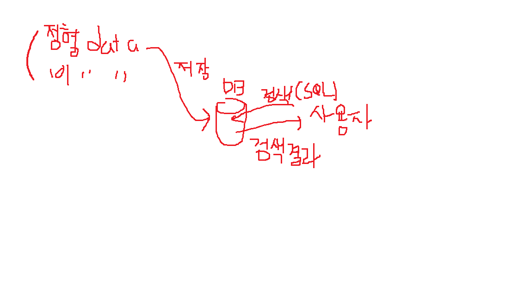
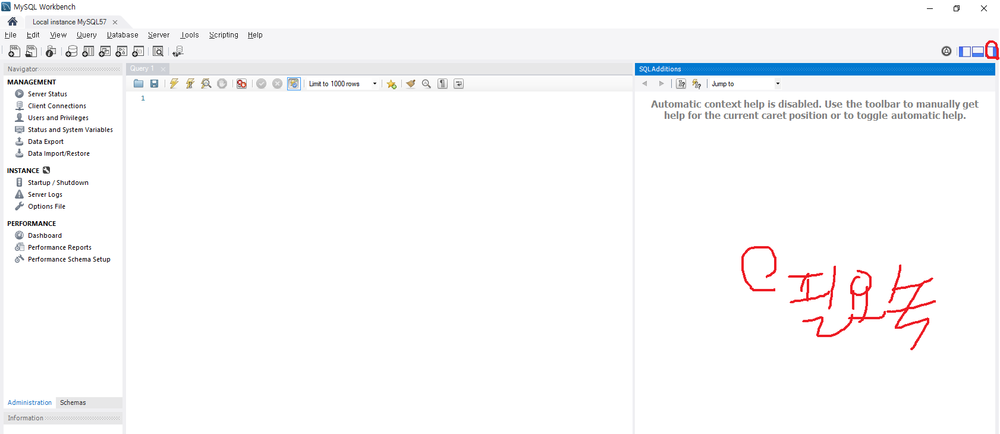
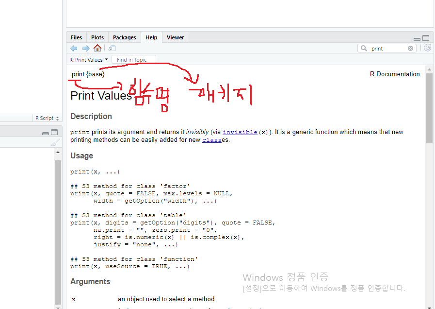

# 목차

0. 요약
1. 핵심단어
2. MS SQL & MS Data Analysis with R
3. 환경설정
4. 명시적 프로그래밍 / 묵시적 프로그래밍

MS 과정 슥 훑듯 넘어가셨습니다. 정말 안 보셔도 되고, 넘어가서 환경설정 파트부터 보시면 됩니다.

# 0. 요약

### R 자료형

>  R에서는 범주형 자료형이 있고, 수치형 자료가 있습니다.

- `factor(팩터)`: 범주형(카테고리)
- `범주형`: 명목형, 순서형으로 나눌 수 있음
  - `명목형`: 데이터간 크기 비교가 불가능한 것(예를 들어 정치성향 - 좌파, 우파)
  - `순서형`: 데이터간 크기 비교가 가능한 것(소, 중, 대; ex. 학점)
- `수치형`: factor(범주형)의 반대. 매우 많음. 예를 들어 점수, 온도 등

### NULL vs NA

- NULL: 변수가 초기화 되지 않은 상태(빈 바구니)
- NA: 바구니 조차도 없음

# 1. 핵심 단어

- ANSI sql - 표준, 하지만, 현재 상황은 ANSI sql과 oracle sql로 나뉘어 있다.
- transaction - 작업의 단위. 예를 들어 ATM에서 돈을 꺼내는 일련의 과정을 하나의 트랜잭션이라고 합니다.
- join - inner join, outer join, cross join 등이 있음.
- EDA(exploring data analysis; 탐색적 분석방법) - 데이터를 탐색해가면서 데이터에 숨어있는 의미를 눈으로 보고 확인하는 과정
- DML(Data Manipulation Language) - DB에서 insert, delete 등을 하는 언어
- implicit programming: 조건을 모두 기술하지 않아도 적절하게 결과를 도출. 딥러닝의 영역.
- explicit programming
- hidden markoff model

# 2. MS SQL & MS Data Analysis with R

이 과정에서는 join하는 것을 별도로 다루지 않습니다. 나중에 R에서 DB를 생성을 하고 테이블을 만들고 일련의 과정을 코딩을 직접 해볼겁니다.

## MYSQL server 2014 책

sql이라는 것은 structed query language라는 것인데 구조적 질의어를 말하는 것입니다.



oracle에서 만든 오라클SQL이 있어요

오라클에서 만든 sql이기 때문에 오라클sql이라고 하는데요, 오라클sql을 많이 쓰는 것은 오라클 서버에서 많이 쓰겠죠

ms에서 만든 것은 mssql이라고 합니다.

이처럼 sql을 만든 회사가 여러 곳이 있어요. 여러 군데에서 만든 sql이 약간씩 다르단 말이에요

문법적으로 좀 다르다구요.

이것이 여러분들처럼, sql을 다루는 사람들은 어느 하나의 db만 다루는 것이 아니라 다양한 종류의 DB를 다룰 줄 알아야해요.

실제 전문가들도 헷갈려요. 그럴 수 밖에 없죠

그래도 나름 표준이라고 해서, 처음에는 아주 우후죽순으로 sql이 만들어졌기 때문에 문법이 많이 달랐어요.

그러다가 표준 sql이라고 하는게 있죠. 그래서 표준 sql이라고 해서 `ANSI sql`이라고 하는게 표준인데,

현재 상황을 말씀드릴게요. ANSI sql이랑 oracle sql으로 나뉜다고 볼 수 있다고 보면 돼요.

그래서 표준 싸움을 하고 있는거라고 보면 돼요.

검색이라는 작업만이 db에서 하는 작업이 아니구요. 검색을 할 수도 있구요

자료를 데이터베이스에 저장할 수도 있겠죠. 예를 들어 특정 회원을 검색하고 싶어요.

회원에 대한 정보를 저장해야되겠습니다. 기존의 회원이 본인의 개인정보를 수정을 합니다.

그러면 데이터 베이스 안에 저장되어 있던 본인의 자료가 저장이 되겠죠.

또 어떠한 회원이 특정 사이트로부터 탈퇴를 합니다. 그러면 탈퇴한 회원에 대한 삭제를 해야 되겠죠.

이 네 가지 작업(검색, 저장, 수정, 삭제)을 수행하는 것을 CRUD라고 부릅니다.
- C: 생성(create; db 객체 생성)
- R: 검색(read)
- U: 갱신(update)
- D: 삭제(delete)

이 네 가지 작업이 데이터베이스에서 이루어집니다.

분석을 하려면 데이터가 적절한 형태로 저장되어 있어야 합니다.

우리의 과정은 DB에 대해서 공부하는 과정이 아닙니다.

따라서 데이터베이스 튜닝 등은 관심사가 아니라서 공부하지 않습니다.

우리한테 필요한 것은 SQL명령어를 내리는 정도에요. 따라서 크게 부담가질 필요 없습니다.

### MODULE 2. TSQL

TSQL은 Transaction을 들어보셨죠. **작업의 단위**를 `transaction`이라고 하는데요. `TSQL`은 **transaction을 하기 위한 sql**이라는 말입니다.

T-SQL은 기존의 ANSI sql에다가 mssql에서 부가한 기능이 추가된 sql을 T-SQL이라고 불러요.

`ansi 표준`에다 `ms의 부가한 기능`이 있는 것이 `T-SQL`이라고 합니다.

검색하는 법을 잘 아셔야겠죠

### MODULE 4. join

join이라는 단어가 보이시죠. 이게 데이터 전처리에서 빈번하게 사용되는 것인데요.

이 결합의 단위는 테이블이에요. 두 개의 테이블이 주어져 있을 때, 원하는 결합을 선택해서 자료들을 합치는 작업을 join이라고 얘기합니다.

join이라는 말은 두개의 테이블을 합친다. 합쳐서 하나의 테이블을 만든다. 이렇게 이해하시면 되요.

그 조인도 즉 테이블을 연결하는 것도 방법에 따라서 종류가 다양하게 있어요.

- lesson2에는 inner join
- lesson3에는 outer join(외부조인)
- lesson4에는 cross join

이것은 분석하는 과정에서 (EDA라고 합니다.) 하는 것으로 하기로 하고.


### module 5. 정렬, 필터링

문자의 경우에도 정렬이 있는데, 문자의 경우에는 알파벳으로 따졌을 때, A부터 Z까지 오름차순으로 하는 것을 오름차순 정렬합니다. 한글의 경우에는 가부터 하까지.

다음에는 데이터 `필터링`이 나와있는데, 원하는 데이터를 뽑아 낼 수 있어야 하거든요. 분석하다가 흔하게 마주하게 되는 작업은 필터링 하는 것입니다. **기준을 하나 둬서 기준에 부합하는 것을 뽑아내는 것**을 말합니다. 년도에 2019년에 해당하는 자료를 뽑아와야 하는 것 아닙니까. 이것이 필터링이죠.

총무부에 해당하는 자료만 가지고 분석하고 싶다. 추출된 총무부 데이터만 가지고 분석을 하는 것이죠. 이것을 필터링이라고 하는데, 필터링을 하려면 필터를 만들어야죠

### module 6. 데이터 타입

이것도 용어 정리를 하고 가죠. 데이터 타입이 항상 나옵니다.

우리는 딥러닝을 배우죠. 딥러닝을 포함하고 있는 개념이 머신러닝, 머신러닝을 포함하고 있는 집합이 인공지능,

인공지능까지 포함하고 있는 것이 computer science라고 할 수 있는데,

우리가 딥러닝을 공부하는 이유가 첫 번째는 취업하기 위함입니다. 취업을 할려고 해서 딥러닝을 공부하는데,

그럼 회사에서는 돈을 벌기 위해 여러분들을 채용하는 것인데

그 돈이라는 것은 누가 주는 것이냐, 그 회사에서 물건을 사는 사람들이(국가 일수도 있고, 개인일 수도 있고, 기업일수도 있고) 줍니다.

필요하니까 구매하는 것이죠

**인공지능이 필요한 이유**는 **결국 사람들이 편해지기 위함**입니다.

그럼 사람이 편해지려면, 사람이 어려워하는 일을, 사람이 하기 힘든 일은 딥러닝이 대신 할 수 있기 때문이죠.

그럼 사람이 하는 일을 딥러닝이 대신 해주는 거죠

사람들이 다루는 모든 문제들은 일반화시켰을 때 원시적인 측면에서

사람이 하는 일들에 대한 데이터를 생각해보면, 간단하게는 수치계산 많이 하잖아죠

그럼 수치연산을 사람들이 많이 필요로 하는데, 인공지능이 이것을 대신 해주는 것이 아니겠습니까

또 데이터 중에서 문자 데이터들이 많이 있습니다. 또 밖에, 자율주행차가 다닙니다.

자율주행차를 생각해보세요. 인공지능이 해야할일이 많이 있습니다. 대표적으로 앞의 차가 멈추면 멈춰줘야해요.

빨간불이에요 멈춰야합니다. 파란불입니다 달려야합니다.

아주 많은 상황들이 주어지더라도 거기에 따라서 적절하게 처리하도록 설계되어야 합니다.

결국 한숨 자고 일어날테니 운전은 니가 해 하는거 아닙니까

운전자가 더 편해지려고 하는 것 아니겠습니까

지금 딥러닝을 얘기하려는 것이 아니고, 데이터 타입을 말하려는 것인데

**바로 앞에 물체가 있을때 컴퓨터는 이미지를 모릅니다.**

물체를 수치화 시킨 것이 데이터 아닙니까.

그렇게 따지면 물체도 수치라고 볼 수 있겠죠

**데이터는 결국 수치화 시켜야합니다.**

**수치로 만드는 작업을 해줘야해요.**

AI뿐만이 아니라 모든 데이터의 타입은 수치에요.

수치 데이터도요 좀 더 들어가면, 세분화 시키는 것이 실수만 놓고 생각해봅시다.

컴퓨터 사이언스는 정수와 실수를 나눠요. 정수는 소수점이 없는 수라고 부르고, 소수점이 있는 수를 실수라고 부릅니다.

우리가 부르는 수는 실수(double, float)와 정수(integer)라고 부릅니다.

결국 데이터 타입은 이겁니다. 사람들이 처리해야 할 일을 좀 더 들여다 보게 되면 수치형태의 데이터가 대부분이고 문자 데이터가 상당히 있습니다.

데이터 타입은 숫자와 문자로 나뉘고 날짜 형식이 따로 있습니다. 연-월-일로 구분할 수 잇는 날짜데이터 또한, 형식이 따로 존재한다.

### module 7. DML

데이터들에 대해서 manipulation(조작)하고싶은 거에요. 그것을 DML이라고 합니다.

데이터 조작한다는 것이 예를 들어서 insert를 한다든지, 삭제한든지, 추가한다든지 이러한 것들이 해당합니다.

데이터를 추가하는거죠

lesson2에는 데이터를 제거할 수도 있구요, modify할 수도 있겠죠

### module 8. built-in function

함수는 내장함수와 내장되어져 있지 않은 함수로 나눌 수 있습니다.

내장되어 있지 않은 것은 로딩 작업을 거쳐서 사용하게 됩니다.

built-in 되어 있느냐 안되있느냐 하는 차이도 있구요

시스템 함수냐, 사용자 정의 함수냐 이렇게 또 나누기도 합니다.

### module 9. 데이터 집계 및 그루핑

group-by라는 것을 많이 다루게 되요.

excel에 pivot table이라고 알아요?

excel에 있는 테이블을 여러분들이 원하는 그 어떤 모습으로 변환하는 것을 말하거든요

변환하는 것을 피봇 테이블이라고 하고, 그 기능을 다른 말로 데이터 재 구조화라고도 합니다.

그루핑 한다는 것은 기준에 따라서 데이터를 묶어주는 작업을 말하겠죠

예를 들어, 총무부 직원들에 대한 평균을 구한다든지 하는 일련의 작업을 말하는 것인데요

이처럼 데이터를 처리하기 위해서 재 구조화하는것이 구조화 하는거죠

### module 10. subquery 라는 것이 나오는데 거의 쓸 일이 없어요

query가 질의문이잖아요. query안에 query를 넣는 거를 말해요

### module 11. table expression이라고 나오는데, 테이블에 대한 작성방법이 나오죠

### module 12. set operator를 이용해서 연산을 하는 것이 나와있습니다.

union같은 것을 이용해서 결합하는 것을 말합니다.

### module 13. windows ranking, opset 등이 나옵니다.

### module 14. pivot 그루핑하는 것이 나와있고,

### module 15. musttured? procedure라고 해서

procedure는 함수와 의미가 비슷해요.

### module 16. T-SQL에서 프로그래밍 하는 것이 나와있죠

### module 17. 에러를 처리하는 구문이 나와있는데, 우리와는 거리가 약간 먼 것들입니다.

간단하게 말씀드리자면, 에러가 발생될 것을 미리 예상하고 대비하는 거에요

에러가 나오면 당황스러우니까 에러가 발생되더라도 적절하게 사전에 정의한 형식으로 구문을 만들 수 잇는데요

그것과 관련된 모듈이라고 할 수 있습니다.

### module 18에는 transaction이라고 나와있는데요

용어 정의를 하고 넘어가겠습니다. `transaction`은 뭐냐

일상생활에서는 ATM기 있죠. **ATM기에서 돈을 인출하기까지의 과정**들을 transaction이라고 하죠

작업의 단위

하나의 transaction은 여러개의 작업으로 이루어지는 것이 보통입니다.

1. 현금카드를 집어넣죠
2. 어떤 작업을 할 거냐 물어볼거 아닙니까. 작업선택해야합니다.
3. 비밀번호같은거 물어보죠? 비밀번호 입력하고,
4. 얼마 출금하겠습니가? 출금액수 입력하게되죠
5. 잔액이 있는지 없는지를 확인할 것이고
6. 마지막으로 출금 또는 입금의 결과가 나오면서 종료될 것입니다.

transaction은 이렇게 여러개의 명령의 집합인데요,

마지막에 정말로 출금하시겠습니까? 했을 때 모든 것이 취소되고, 앞의 작업들이 없는 것이 되는데

이것을 db에서는 rollback이라고 합니다.

완료가 되기 전까지 일련의 과정을 모조리 취소해 버리는 것을 rollback이라고 합니다.

rollback과는 반대로, 그 때까지 반대로 그 때까지 했던 작업을 저장하는 것을 commit이라고 합니다.

이 명령어들이 있어요.

여러분들이 트랜잭션을 작성하는 구문을 작성했어요

중간에 rollback이라는 명령어를 실행하면 그 전에 실행했떤 작업들이 모두 취소가 된다.

commit을 하면 완료가 되고. 그러니까 저장이 되어버리고.

이것도 dbms라고 부르는데, dbms의 종류에 따라 조금씩 차이가 있습니다만,

commit을 하게 되면 현재까지 했던 것이 저장됩니다.

## analyzing big data with microsoft R

전자공학쪽에서는 matlab이라는 것을 많이 썼고, 통계쪽에서는 sas를 사용합니다.

matlab에서는 c언어의 냄새가 많이 납니다. 일반인들이 접근하기는 어려워요

`life is too short. you need python`

프로그래밍을 즐겨하는 사람들은 파이썬을 선호하는 편이고, 분석을 하는 사람들은 R을 좀 더 사용합니다.

R을 이용해서 머신러닝을 할 수 있죠

R로 딥러닝도 당연히 가능합니다.

가능한데, R을 이용해서

여기 교재에는 R Server에 대한 

### R server, R client에 대해서 나와있죠

R server가 있는데, 서버에 접속해서 여러분들이 분석 작업을 하는거죠

빅데이터가 뭐죠?

어느정도 커야 빅데이터죠?

빅데이터는 학자들마다 정의하는 것이 다르고, 그렇습니다.

빅데이터라고 하면 그래도 테라는 넘어가야죠. 수 mega만 되도 bigdata라고 할 수 있고,

다루는 사람의 입장에서 주관적인 기준에 의해서 빅데이터의 규모는 달라질 수 잇을 거라고 생각합니다.

`EDA(exploring data analysis; 탐색적 분석방법)`

**데이터를 탐색해가면서 데이터에 숨어있는 의미를 눈으로 보고 확인하는 과정**

평균과 중위수를 딱 보면 평균이 특정값에 의해서 편향이 되었는지 아닌지 확인할 수 있을 것이고,

그거에 대한 설명이 이것이고

### module3 에서는 visualizing이라는 것이 나와있죠

수치로 보는 것보다는 시각화해서 보면 확연하게 볼 수 있죠

다양한 도구들을 알아야하는데

pythono에서는 matplotlib에

matplotlib, seaborn.

R에는 ggplot2을 이용해서 시각화를 하게됩니다.

R의 ggplot2 도구를 python에서도 사용을 가능하도록 한 것이 있어요

### module4. 에서는 processing big data라고 나와있네요

우리가 원하는 모양으로 데이터를 변환하는 과정이 나와있구요

데이터를 처리할 때 병렬처리를 할 수 있어요

코어를 여러개로 나눠서 병렬 처리를 할 수 잇다.

### module 6에는 regression 모듈을 만들고 평가하는 것이 나와있네요

머신러닝이라든지 빅러닝에서 다루는 문제는 크게 분류문제와 예측 문제로 나눌 수 있어요

먼저 분류문제는 classification이라고 하죠. 분류는 또 2가지로 나뉘어져요. binomial classification, multi nomial classification

binomial classiciafion(이항분류)은 암이다/아니다. 예/아니오로 답할 수 있는 것이 여기에 해당합니다.

학점같은 경우에는 multinomial classification(다중분류)라고 합니다.

예측에서는 regression이 있습니다

회기 문제 같은 경우에는 결과가 연속형 결과로 나오게 됩니다.

에를 들자면, 오늘 저녁에 기온이 어떻게 될 것인지 예측하고 싶어요. 

단순 선형 회기라고 해서, linear regression이라고 하고, 

최소 제곱법이라고 해서, 실측치와 오차를 최소로 하는 그 모델을 만들 때 단순히 직선 형태로 만들 때

단순 선형 회기라고 부릅니다. 단순 선형회기는 기본적으로 꼴이 직선이에요

이게 단순 선형회기 직선입니다.

y = a1x1 + a2x2 + a3x3 + ... anxn + b

여기에서는 변수가 여러개 있죠. `multi variable linear regression`이라고 합니다.

여러분이 만들게 되는 모델은 이렇게 단순하게 나오는 모듈 뿐만이 아니라, 복잡한 모델들도 만들게 됩니다.

모델을 만들게 될 때 중요한 것이, x는 데이터고, a와 b를 찾는 것이 중요합니다. 특히 a가 얼마냐 찾는 것이 중요합니다.

### module 8에서는 hadoop으로 하는 과정이 나와있는데

hadoop은 리눅스에서 잘돌아가요

하둡으로 분산처리를 하려면 java를 좀 해야해요.

당연히 java도 설치되어 있어야하고 java도 프로그래밍 할 수 있어야하고.

이 부분도 플랫폼 부분이라서 우리와는 거리와 있고.


# 2. 환경설정

1. mysql 설치 http://dev.mysql.com/downloads/mysql
   1. 설치 중 choosing a setup type => custom 또는 developer default로 하면 됨.
   2. 설치항목
      1. applications -> mysql workbench -> ... -> 에서 더이상 항목이 열리지 않을 때까지 가서 오른쪽으로 옮기기
      2. app -> notifier... mysql notifier 우측 화살표 클릭
      3. docu -> samples and examples -> 우측 화살표 클릭
      4. mysql servers -> x64로 설치
   3. 이후는 전부 기본으로 설치
2. r 설치 http:// www.r-project.org
3. rstudio 설치 http://www.rstudio.com



# 3. 명시적 프로그래밍 / 묵시적 프로그래밍

- implicit programming
- explicit programming

명시적 프로그래밍의 예시
```
if x < 10 then "한자리수"
else "2자리수 이상"
```

`묵시적 프로그램`은 **조건을 모두 기술하지 않아도 적절하게 결과를 도출**

알고리즘쪽에서는요

프로그램 성능을 얘기할 때, 얼마나 좋은 프로그램인지 나타내는 평가지표가 있습니다.

R도 그렇고 Python도 그렇고 numpy를 사용하는데, 행렬 연산을 빠르게 도와주는 툴입니다.

우리가 하는 딥러닝은 implicit programming 영역이다.

R에서는 RStudio에서 합니다.

성직자겸 수학자인 베이즈라는 사람이 있는데 베이즈의 이론을 바탕으로 `베이지안 분류기`

베이즈이론 기반으로 마르코프라는 수학자가 있는데 베이지안 분류기를 계승해서 hidden markoff model이라는 것이 있습니다.

신용평가회사에서 많이 쓰는 건데, 이 사람에게 대출을 해줘도 되는건지. 이런걸 요즘에는 변수들이 너무 많아서 이게 사람이 할 수 있는 영역이 아니라는 것입니다.

## 실습


### 현재 작업 경로 변경
Tools > global options > General에서 변경

### 글자 크기 변경

출력화면에 나오는 [1] 등의 기호는 출력결과의 줄을 나타냅니다.

ctrl + enter를 눌러야지 현재 커서가 있는 줄을 실행합니다.

`콘솔창에서 화면 클리어`: `ctrl + L`

오른쪽 상단의 tab 단추가 세개가 있는데요. Environment, History, 

history 탭에는 왼쪽 상단에 load history from an exist file이라고 있어서

과거에 작업을 했던 목록이 저장되어 있다면, 과거에 수행했던 명령어를 가져와서 실행할 수 있습니다.

오른쪽에는 저장단추 있죠. history

history창에서 enter치면 콘솔창으로 가고, ctrl + enter치면 스크립트 영역으로 복사됩니다.

### 도움말

도움말은 다음과 같이 볼 수 있습니다.(함수에 커서 갖다대고, F1)



패키지는 함수들의 묶음입니다.

요긴하게는 examples가 매우 도움이 됩니다.

좀 더 자세한 도움말을 보고자 한다면,

help창의 아랫쪽에서 [Package base version 3.6.0 Index]라고 나와있는 부분이 있는데,

index를 클릭해서 찾아들어가면 볼 수 있습니다.

### 데이터 불러오기

```R
> install.packages("randomForest")
> library(randomForest) # 메모리에 로딩
randomForest 4.6-14
Type rfNews() to see new features/changes/bug fixes.
```

randomForest로 도움말 검색하면 해당 함수가 나옵니다.

변수: 변할 수 있는 것

```R
a <- 3
b <- 2
```

randomForest에서 r은 소문자이고, F는 대문자인데, 일반적으로 이름은

영문자를 쓰되, 단어의 이미가 데이터의 특성을 갖도록 해주는 것이 일반적이고, 두 단어 이상이면 첫 번째는 소문자로 쓰고 하는 것이 전 세계적인 변수작성 방법입니다.

데이터가 저장되는 장소를 변수라고 할 수 있습니다.

다른 언어들과의 대표적인 차이점으로서, `<-` 왼쪽 화살표 기호를 사용하게 됩니다.

```R
x1 <- 1
x2 <- 1.5
x3 <- x1+x2
```

이렇게도 쓰기는 하는데, 화살표 기호를 좀 더 많이 사용합니다. 그리고 assign to 기호(=)가 가끔 안될 때가 있기 때문에 화살표 기호를 쓰는게 좋습니다.

```R
NA
```

NA는 파란색으로 표시되는데 미리 약속된 것이라고 합니다. 이것을 예약어라고 합니다.

NA는 값이 없음을 나타내는 상수입니다.

0과 NA를 구별해야 하는데, 0은 시험을 봤는데 다틀린 것이고, NA는 아예 시험을 보러 오지 않은 것입니다.

```R
NA+1
```

위의 결과는 NA가 나오는데, NA와 어떠한 연산을 해도 NA가 나옵니다.

```R
four<-NA
is.na(four)
```

저장된 데이터가 NA인지 확인하려면, 위와 같이 입력하면 됩니다.

자료형 중에는 숫자형도 있고, 문자형도 있고, 이 외에도 boolean형도 있습니다.

- NULL: 변수가 초기화 되지 않은 상태(빈 바구니)
- NA: 바구니 조차도 없음

```R
x<-NULL
is.null(x)
```

문자열을 사용할 때는 홑따옴표도 사용 가능하고, 겹따옴표도 사용가능합니다.

```R
&연산자(and)
|연산자(or)
!연산자(not)
```

R에서는 범주형 자료형이 있고, 수치형 자료가 있습니다.

- `factor(팩터)`: 범주형(카테고리)
- `범주형`: 명목형, 순서형으로 나눌 수 있음
  - `명목형`: 데이터간 크기 비교가 불가능한 것(예를 들어 정치성향 - 좌파, 우파)
  - `순서형`: 데이터간 크기 비교가 가능한 것(소, 중, 대; ex. 학점)
- `수치형`: factor(범주형)의 반대. 매우 많음. 예를 들어 점수, 온도 등

```R
> sex<- factor("f", c("m", "f")) # 초기값을 f로 하겠다. and c는 함수인데, c는 벡터화 시켜주는 함수 입니다.
> sex
[1] f
Levels: m f
```

나중에 프로젝트 할텐데, 사진으로 하는 것은 많이 고민을 많이 해보셔야 합니다.

왜냐면 실제로 사진이 있어야 하기 때문입니다. 회사에서도 제일 구하기 힘든 것이 사진입니다.

