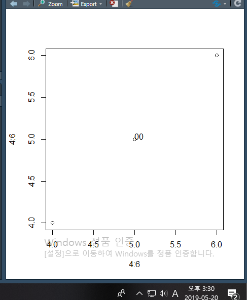

```R
library(foreign)
library(readxl)
library(ggplot2)
library(dplyr)
raw_welfare<-read.spss(file="Data/koweps.sav", to.data.frame = T)
welfare<-raw_welfare
str(welfare)
View(welfare)
summary(welfare)

welfare<-rename(welfare,
                sex=h10_g3,  #성별
                birth=h10_g4, #연도
                marriage=h10_g10, #혼인여부
                religion=h10_g11, #종교
                income=p1002_8aq1, #급여
                code_job=h10_eco9, #직종코드
                code_region=h10_reg7) #지역 코드드
str(welfare) 

#성별에 따라 월급 차이?
class(welfare$sex)
table(welfare$sex)
#성별에 0이 들어가 있는 경우에는 NA로 처리
#welfare$sex<-ifelse(welfare$sex==0,NA,welfare$sex)

table(is.na(welfare$sex))

welfare$sex<-ifelse(welfare$sex==1,"male","female")
table(welfare$sex)

qplot(welfare$sex)

class(welfare$income)
summary(welfare$income)

qplot(welfare$income)+
  xlim(0,1000)

#0, 9999
welfare$income<-ifelse(welfare$income %in% c(0,9999), NA, welfare$income)

table(is.na(welfare$income))
#na : 12030 => 12044

#성별에 따른 월급 차이 분석하기
sex_income<-welfare %>% 
  filter(!is.na(income)) %>% 
  group_by(sex) %>% 
  summarise(meanIncome=mean(income))

sex_income
ggplot(data=sex_income, aes(x=sex, y=meanIncome))+  geom_col()

#몇 살때 최고급여?
summary(welfare$birth)
table(is.na(welfare$birth))

welfare$birth<-ifelse(welfare$birth==9999, NA, welfare$birth)
table(is.na(welfare$birth))

welfare$age<- 2019-welfare$birth+1

welfare$age

welfare<-welfare %>% 
  mutate(ageg=ifelse(age<30,"young",
                     ifelse(age<=59,
                            "middle","old")))
table(welfare$ageg)
qplot(welfare$ageg)


ageg_income<-welfare %>% 
  filter(!is.na(income)) %>% 
  group_by(ageg) %>% 
  summarise(meanIncome=mean(income))

ggplot(data=ageg_income, 
       aes(x=ageg, y=meanIncome))+
  geom_col()

#나이순으로 정렬하여 출력
ggplot(data=ageg_income, 
       aes(x=ageg, y=meanIncome))+
  geom_col()+
  scale_x_discrete(limits=c("young", "middle", "old"))

#성별 월급 차이는 연령대별로 차이?

sex_income<-welfare %>% 
  filter(!is.na(income)) %>% 
  group_by(ageg, sex) %>% 
  summarise(meanIncome=mean(income))
sex_income

ggplot(data=sex_income, aes(x=ageg, y=meanIncome, fill=sex))+
  geom_col()+
  scale_x_discrete(limits=c("young", "middle", "old"))

ggplot(data=sex_income, aes(x=ageg, y=meanIncome, fill=sex))+
  geom_col(position = "dodge")+
  scale_x_discrete(limits=c("young", "middle", "old"))


###2일차 과제 풀이###

#1~4
library(ggplot2)
mpg_new<-as.data.frame(mpg)
mpg_new<-mpg_new %>% mutate(total=cty+hwy)
mpg_new

mpg_new<-mpg_new %>% mutate(mymean=total/2)

mpg_new %>% 
  arrange(desc(mymean)) %>% 
  head(3)


mpg %>% 
  mutate(total=cty+hwy,
         mymean=total/2) %>%
  arrange(desc(mymean)) %>%
  head(3)
class(mpg)
#5~8
mpg<-as.data.frame(mpg)
mpg %>% 
  group_by(class) %>% 
  summarise(meanCty=mean(cty)) %>% 
  arrange(desc(meanCty))

mpg %>% 
  group_by(manufacturer) %>% 
  summarise(meanHwy=mean(hwy)) %>% 
  arrange(desc(meanHwy)) %>% 
  head(5)

mpg %>% 
  filter(class=="compact") %>% 
  group_by(manufacturer) %>% 
  summarise(count=n()) %>% 
  arrange(desc(count))

midwest<-as.data.frame(midwest)
str(midwest)

midwest<-midwest %>% 
  mutate(ratio_child=(poptotal-popadults)/poptotal*100)

midwest %>% 
  arrange(desc(ratio_child)) %>% 
  select(county, ratio_child) %>% 
  head(5)

midwest<-midwest %>% 
  mutate(grade=ifelse(ratio_child>=40,"large",ifelse(ratio_child>=30,"middle","small")))
table(midwest$grade)

midwest %>% 
  mutate(ratio_asian=(popasian/poptotal)*100) %>% 
  arrange(ratio_asian) %>% 
  select(state, county, ratio_asian) %>% 
  head(10)

#9~
mpg <- as.data.frame(ggplot2::mpg) # mpg 데이터 불러오기 
mpg[c(65, 124, 131, 153, 212), "hwy"] <- NA # NA 할당하기

table(is.na(mpg$drv))
table(is.na(mpg$hwy))

mpg %>% 
  filter(!is.na(hwy)) %>% 
  group_by(drv) %>% 
  summarise(meanHway=mean(hwy))

mpg <- as.data.frame(ggplot2::mpg) # mpg 데이터 불러오기 
mpg[c(10, 14, 58, 93), "drv"] <- "k" # drv 이상치 할당 
mpg[c(29, 43, 129, 203), "cty"] <- c(3, 4, 39, 42) # cty 이상치 할당

table(mpg$drv)
mpg$drv<-ifelse(mpg$drv %in% c("f","r","4"),mpg$drv,NA) 
#"f" %in% c("f","r","4") =>TRUE
#"k" %in% c("f","r","4") =>FALSE
table(mpg$drv)

boxplot(mpg$cty)$stats

mpg$cty<-ifelse(mpg$cty<9 | mpg$cty>26,NA,mpg$cty)
boxplot(mpg$cty)

mpg %>% 
  filter(!is.na(drv) & !is.na(cty)) %>% 
  group_by(drv) %>% 
  summarise(meanCty=mean(cty))
  ```

reorder를 하고 싶으면 다음과 같이 쓰면 되는데, reorder의 인자는 factor여야 합니다.

```R
# 내림차순
ggplot(data=top10, aes(x=reorder(job, meanIncome), y=meanIncome))
+geom_col()
# 오름차순
ggplot(data=top10, aes(x=reorder(job, -meanIncome), y=meanIncome))
+geom_col()

bottom10<-jobIncome %>%
    arrange(meanIncome) %>%
    head(10)

bottom10

# 남성 직업 => 상위 10개 추출
# 남성 직업 => 빈도 10개 추출

job_male<-welfare %>%
    filter(!is.na(job) & sex=="male") %>%
    group_by(job) %>%
    summarise(n=n()) %>%        # n이라는 함수가 count하는 것임
    arrange(desc(n)) %>%
    head(10)

job_male<-welfare %>%
    filter(!is.na(job) & sex=="female") %>%
    group_by(job) %>%
    summarise(n=n()) %>%        # n이라는 함수가 count하는 것임
    arrange(desc(n)) %>%
    head(10)

# 종교에 따른 이혼율?

welfare %>%
    filter(!is.na(group_marriage)) %>%
    group_by(religion, group_marriage) %>%
    summarise(n=n()) %>%
    mutate(tot_group=sum(n)) %>%
    mutate(pct=round(n/tot_group*100, 1))
religion_marriage
# round(5/8.2)

code_region<-data.frame(code_region=c(1:7),
    region=c("서울",
    "수도권(인천/경기)",
    "부산/경남/울산",
    "대구/경북",
    "대전/충남",
    "강원/충북",
    "광주/전남/전북/제주도")
    )

list_region

welfare<-left_join(welfare, list_region, id="code_region")
welfare %>%
    select(code_region, region) %>%
    head

region_ageg<-welfare %>%
    group_by(region, ageg) %>%
    summarise(n=n()) %>%
    mutate(tot_group=sum(n)) %>%
    mutate(pct=round(n/tot_group*100, 2))
region_ageg

ggplot(data=region_ageg, aes(x=region, y=pct, fill=ageg))+
    geom_col()+
    coord_flip()

region_ageg %>%
    filter(ageg=="old") %>%
    arrange(pct)

```

## 지도 시각화

```R
install.packages("ggiraphExtra")
library(ggiraphExtra)
str(USArrests)
```

```R

plot(4:6, 4:6)
text(5, 5, "00", adj=c(0,0)) # 우측 상단에 표시
text(5, 5, "01", adj=c(0,1)) # 우측 하단에 표시
text(5, 5, "10", adj=c(1,0)) # 좌측 상단에 표시
text(5, 5, "11", adj=c(1,1)) # 좌측 하단에 표시

plot(cars, cex=.5)
text(cars$speed, cars$dist, pos=4) # pos를 1로 주면, 2로주면 왼쪽, 3으로 주면 윗쪽, 4로주면 오른쪽
```



분석을 한 다음에 유의성 검증을 해야해요

t-test나 t-value같은게 있어요

가설에 대한 검정이 있어야해요. 기각이다 아니다. 이런부분들이 진행이 되어야지.

분석에서 더 나아가서 머신러닝까지는 해야 뭐가 나와요.

프로젝트는 여러분들이 kaggle.com도 좋고 사이트 몇개 알려드릴텐데 data.go.kr알려드렸죠

그 쪽이 데이터셋을 오픈해 놓은 것이 많아요

전 세계에 있는 대학들 중에서, 미국 소재 대학교들은 오픈해놓은 대학이 많아요

전에 프로젝트 공모전 사이트 알려드렸었죠.

공모전이랑 함께 프로젝트로 하셔도 괜찮구요

공모전은 혼자하면 굉장히 허접하게 나와요.

3~4명에서 하는 것이 좋습니다.

공모전에 도전을 하는 것이 좋을 것 같다.

이렇게 deep learning위주로 수업을 나가다 보니까, 이미지 분류

```R
# 오늘 했던 소스코드

install.packages("ggiraphExtra")
library(ggiraphExtra)
str(USArrests)
# 행인덱스로 사용되면, 직접적으로 사용을 못해요.
# 직접적으로 사용을 못해요

library(tibble) # rownames_to_column을 사용하기 위해.
crime<-rownames_to_column(USArrests, var="state")
crime

crime$state<-tolower(crime$state)
crime

install.packages("maps")
library(maps)
states_map<-map_data("state") # 소문자로만 들어가야함.
str(states_map)

install.packages("mapproj")
library(mapproj)
ggChoropleth(data=crime,
             aes(fill=Murder, 
                 map_id=state),
             map=states_map)

plot(iris$Sepal.Width, iris$Sepal.Length, cex=.5, pch=20, xlab="width", ylab="length", main="iris", col="#ff0000")
# cex는 크기, 
# pch는 모양

x<-seq(0,2*pi, 0.1)
pi  # pi는 이미 정의되어 있음
y<-sin(x)
plot(x,y, cex=0.5, col="red")
lines(x,y)
abline
cars
plot(cars, xlim=c(0,25))
abline(a=5, b=3.5, col='red') # 직선을 그리는 함수. y=b*x+a
# pi
abline(h=mean(cars$dist))
abline(v=mean(cars$speed))

# 함수에 대한 내용들이 많아서 이정도로 보구요
# 기타 텍스트를 출력하는 것도 해봐야 하는데, 원하는 좌표에 텍스트를 출력하는 것도 가능하죠
# 또 플롯이라는 것을 만들어볼게요

plot(4:6, 4:6)
text(5, 5, "00", adj=c(0,0)) # 우측 상단에 표시
text(5, 5, "01", adj=c(0,1)) # 우측 하단에 표시
text(5, 5, "10", adj=c(1,0)) # 좌측 상단에 표시
text(5, 5, "11", adj=c(1,1)) # 좌측 하단에 표시

plot(cars, cex=.5)
text(cars$speed, cars$dist, pos=4) # pos를 1로 주면, 2로주면 왼쪽, 3으로 주면 윗쪽, 4로주면 오른쪽

plot(cars, cex=.5)
identify(cars$speed, cars$dist) 
#identify 실행하고, 궁금한 지점 클릭을 하면 가장 가까운 점의 좌표가 표시됩니다. 끝나면 finish 누르면 출력됩니다.

plot(iris$Sepal.Width, iris$Sepal.Length, pch=20, xlab="width", ylab="length")
points(iris$Petal.Width, iris$Petal.Length, pch='+', col="#ff0000")

legend("topright", legend=c("Sepal", "Petal"), pch=c(20, 43), col=c("black", "red"), bg="gray")

# 이것은 필수입니다. 
```
