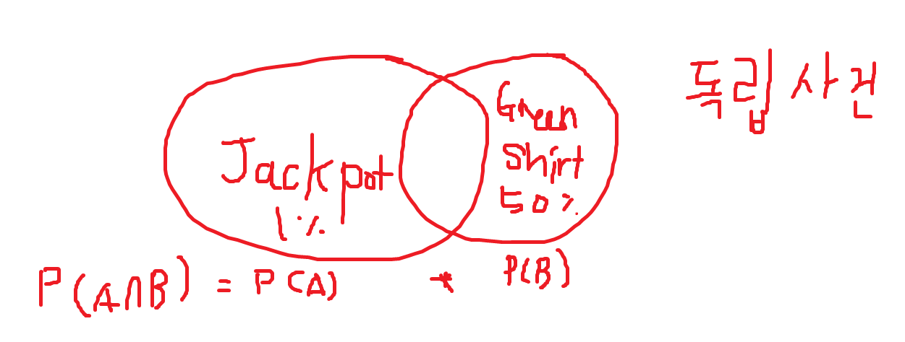
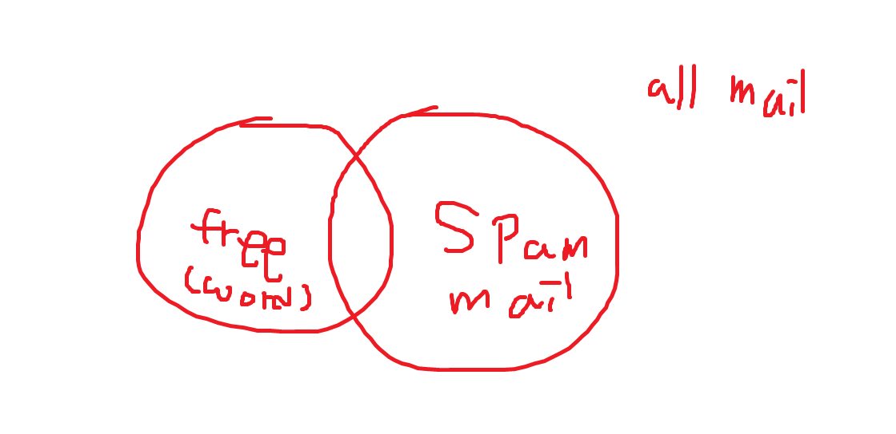
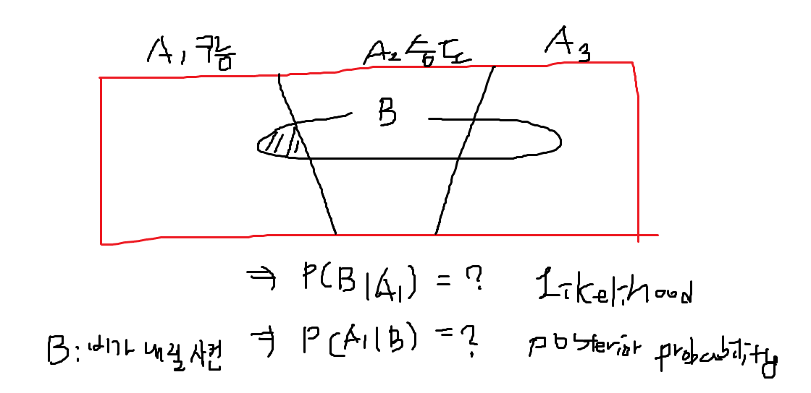

# Bayesian Theory

베이즈 이론을 정리하려면 두 가지를 알아야 합니다.

1. A, B 사건이 서로 영향 주지 않은 경우(독립 사건)

   

2. A, B 사건이 서로 영향 주는 경우(종속 사건)

   


free라는 단어를 사용한 경우 spam일 확률 계산.



free: 4

spam: 3

all mail: 10

P(스팸) = 3/10

P(스팸∩free) = 2/10(이렇게 데이터가 주어졌을 때.)

P(스팸|free)  = ?

# 베이즈 정리


$$
P(A|B) = \frac{P(B|A)P(A)}{P(B)}
$$

- P(A|B): 사건 B가 발생한 상태에서, 사건 A가 발생할 조건부 확률
- P(B|A): 사건 A가 발생한 상태에서, 사건 B가 발생할 조건부 확률
- P(A): 사건 A가 발생할 확률(B에 대한 어떤 정보도 없는 상태)
- P(B): 사건 B가 발생할 확률(A에 대한 어떤 정보도 없는 상태)

$$
P(B|A) = P(A\cap B) / P(A)\\
P(A|B) = P(A\cap B) / P(B)\\
\therefore P(A|B) = \frac{P(B|A)P(A)}{P(B)}
$$


사전 확률(prior probability): 이미 알고 있는 사건의 확률(P(A1), P(A2), ...)

가능도(=우도, likelihood): 이미 알고 있는 사건이 발생했다는 조건 하에서 다른 사건이 발생될 확률()

사후 확률(posterior probability): 사전 확률, 가능도를 통해서 조건부 확률로 베이즈 정리



$$
P(B) = P(A1)\cap P(B) + P(A2) \cap P(B) + P(A3) \cap P(B) \\
P(A1 \cap B) = P(A1) P(B|A1)\\
P(A1|B) = \frac{P(A1 \cap B)}{P(B)}\\
= \frac{P(A1 \cap B)}{P(A1) \cap P(B) + P(A2) \cap P(B) + P(A3) \cap P(B)}\\
= \frac{P(A1)P(B|A1)}{P(A1)P(B|A1) + P(A2)P(B|A2) + P(A3)P(B|A3)}
$$


**직접 사후확률 P(A1|B)를 구할 수 없는 상황에서 사전확률 P(A1), P(A2). P(A3)과 가능도 P(B|A1)를 이용해서 사후 확률을 구할 수 있다.**


**빈도표 & 우도표(가능도표)**

|      | 나이트(빈도표) | 나이트(빈도표) |      | 나이트(우도표) | 나이트(우도표) |
| ---- | -------------- | -------------- | ---- | -------------- | -------------- |
| 빈도 | 예             | 아니오         | 합계 | 예             | 아니오         |
| 스팸 | 4              | 16             | 20   | 4/20           | 16/20          |
| 햄   | 1              | 79             | 80   | 1/80           | 79/80          |
| 합계 | 5              | 95             | 100  | 5/100          | 95/100         |


이렇게 만든 베이즈 분류기는 naive bayse 분류기(filter)라고 합니다.

# 사용례

베이즈 분류기는 과거의 사건 data를 사용해서 미래의 사건 예측에 사용 될 수 있습니다.

- 스팸메일
- IDS(침입 탐지 시스템, 정상/비정상)
- 질병 진단

# 라플라스 스무딩

스팸 메일이 하나도 없는 경우에는 확률이 0이 될 수 있다.

이 것을 해결하기 위해서 확률을 0으로 만드는 것 대신 경우의 수에 1을 더하는 것이 라플라스 스무딩입니다.

(분자가 0이 되는 것을 방지하여 확률이 0이 안되도록 합니다.)

# naive Bayse Filter로 스팸 필터 만들기

프로젝트를 스팸메일을 나이브 베이지안 필터기를 사용하거나, RNN과 혼용해서 사용하는 것도 좋습니다.

나이브 베이즈 분류기를 통해서 스팸 필터기를 만들 때에는 단어들 사이에는 독립이라는 가설이 세워져 있습니다.
$$
P(정상|텍스트)= P(W1, W2, W3|정상메일) = P(W1|정상메일)*P(W2|정상메일)*P3(W3|정상메일)\\
P(스팸|텍스트)= P(W1|스팸)*P(W2|스팸)*P(W3|스팸)
$$


단어의 순서를 고려도 하는 것이 RNN입니다.

n그램을 이용해서 이 문제를 상당 부분 해결할 수 있습니다.


## bi-gram

P(고파요|몹시, 배가) = ?

자동완성을 하기 위해서는 n그램을 이용한 단어 추천이 되겠죠.

n이 커지면 성능이 급격하게 떨어지기 때문에 n을 적절하게 선택하는 것이 좋습니다.

그래서 n이 커지는 경우에 떨어지는 성능은 RNN이 대체해 줍니다.


# BOW 만들기

- Bag Of Words(BOW): 단어들의 등장 횟수로 표현(단어 가방)

  1. 주어진 단어에 대해 고유의 인덱스 부여
  2. 단어의 등장 횟수 벡터 생성

  ```python
  import re
  from konlpy import okt
  token="오늘은 금요일 입니다. 내일은 토요일 입니다. 다음 주 화요일에는 특강이 있습니다."
  token = re.sub("\.", "", token)
  token
  
  token = okt.morphs(token)
  word2index={}
  bow = []
  for voc in token:
      if voc not in word2index.keys():
          word2index[voc] = len(word2index)
          bow.insert(len(word2index)-1, 1)
      else:
          index = word2index.get(voc)
          bow[index] = bow[index] + 1
  print(word2index)
  print(bow)
  
  # scikit-learn에서는 이 작업을 하는 클래스가 있습니다.
  ```

  

```python
from sklearn.feature_extraction.text import CountVectorizer
text = ['you know I want your love. because I love you.']
vec = CounterVectorizer()
vec.fit_transform(text)
print(vec.fit_transform(text).toarray())
print(vec.vocabulary_)

# 불용어 사용하기
vec = CountVectorizer(stop_words=['I']) # to use stopwords.
```


# TF-IDF

TF와 IDF를 곱한 값. 문서 내에서 어떤 단어가 중요한지를 나타냄.

DTM으로부터 TF-IDF를 만들 수 있음

doc1. 자고 싶은 오후

doc2. 자고 싶은 우리

doc3. 많이 졸리는 우리 우리

doc4. 저는 잠꾸러기가 좋아요

|      | 잠꾸러기가 | 많이 | 졸리는 | 자고 | 우리 | 오후 | 싶은 | 저는 |      |
| ---- | ---------- | ---- | ------ | ---- | ---- | ---- | ---- | ---- | ---- |
| doc1 | 0          | 0    | 0      | 1    | 0    | 1    | 1    |      |      |
| doc2 | 0          | 0    | 0      | 1    | 1    | 0    | 1    |      |      |
| doc3 | 0          | 1    | 1      | 0    | 2    | 0    | 0    |      |      |
| doc4 | 1          | 0    | 0      | 0    | 0    | 0    | 0    |      |      |

테이블의 내용은 TF(Term Frequency)임.


문서의 수: D

단어의 수: T

TF: 문서 D에서 단어 T의 등장 횟수

DF: 단어 T가 등장한 문서의 개수

TF-IDF = TF*IDF


# naive-bayes 분류기 만들 때

DTM으로 하는 것보다, TF-IDF로 만드는 것이 더 정확도가 높아보임.