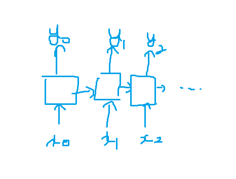

```python
keras.optimizers.SGD(lr=0.01, momentum=0.9) # momentum은 관성의 느낌. local minima를 넘기 위한 방법
```

과적합 해결 방법

1. 훈련 크기 증가
2. 드롭 아웃
3. 정규화

# RNN

- 순서 데이
  - 문장 의미 이해

이후 / 이전 단어 문장 이해


$$
h_t = f_w (h_{t-1}, x_t)
$$
h_t: new state

f_w: some function with parameters W

h_t-1: old state

x_t: input vector at some time step

RNN의 이전 cell과 현재 x_n에 각각 가중치가 곱해져서 현재의 cell에 들어옵니다.


# Vanilla RNN

바닐라 라는 말이 붙어있으면, 무엇인가 첨가를 하지 않은 형태를 바닐라 라고 하잖아요.

뭔가 변형하지 않은, 주어진 상태의.

가장 기본 구조의 RNN을 vanilla RNN이라고 해요.


$$
h_t = f_w (h_{t-1}, x_t) \\
h_t = tanh(W_{hh} h_{t-1} + W_{xh} x_t) \\
y_t = W_{hy} h_t
$$


# sigmod 함수의 단점

미분하면 아래와 같이 최대값이 0.25이고, 0의 값이 많아서 vanishing gradient 문제가 발생합니다.


따라서 RNN에는 vanishing gradient 문제가 발생할 수 있기 때문에, tanh 함수를 사용합니다.

구조

- one to one(vanilla)
- one to many
- many to one
- many to many

개발자를 위한