# Telegram 챗봇 만들기


## [목차]

1. 텔레그램 client 설치 및 bot 생성
2. python에서 telegram api 접속 확인
3. 응답 테스트하기(using requests)
4. 웹훅 설정
5. 언어 모델 추가
6. 원래 기능 복원
7. 배포 - pythonanywhere
8. 결과 확인


## 1. 텔레그램 client 설치 및 bot 생성

텔레그램을 설치해서 BotFather에게 /start라고 합니다.

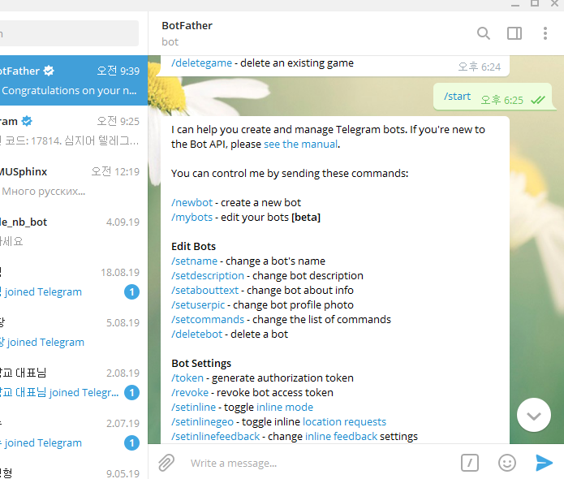

이후, 봇의 이름(name: 봇을 부를 때 사용됩니다.)을 지정하고, 유저이름(username: **고유해야함**)을 지정합니다.

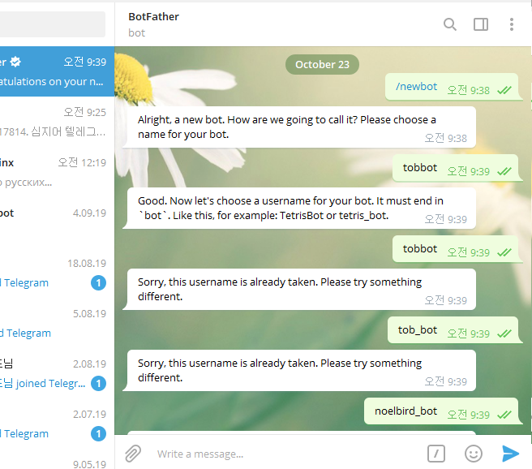

아직 만들긴 했는데 권한이 없어요. 따라서 토큰을 받아서  임시로 저장해 둡니다.

```text
[봇 동작 체크]
구글에서 telegram api를 검색해서 아래의 주소로 들어갑니다.
https://core.telegram.org/bots/api

making request에 들어갑니다.
아래와 같이 아까 텔레그램에서 얻었던 키값과 함께, 주소에다가 https://api.telegram.org/bot<토큰값>/getMe

입력하면 다음과 같이 값이 반환됩니다.
```

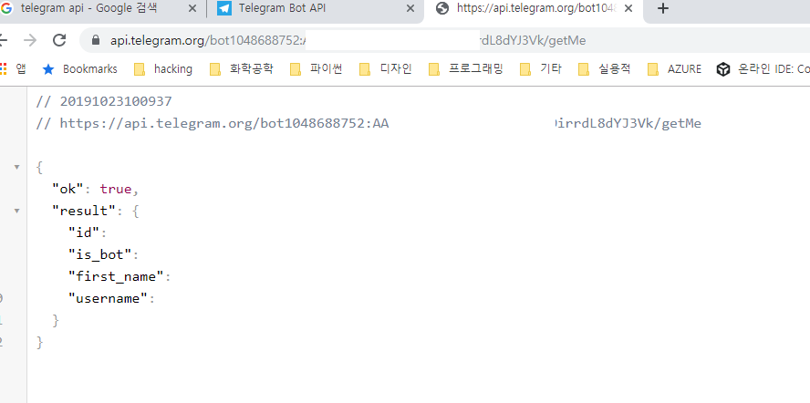


## 2. python에서 telegram api 접속 확인

아까 임시로 저장해둔 TOKEN 등을 환경변수에서 사용하기 위해서 python-decouple을 설치합니다.

```bash
$ pip install python-decouple
```


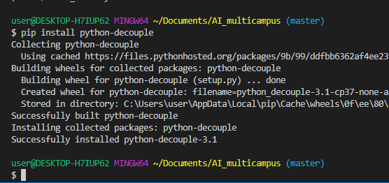


이제 app.py (플라스크의 메인 파일)를 작성해 보겠습니다.

```python
# app.py
from decouple import config

token = config("TOKEN")
api_url = f"https://api.telegram.org/bot{token}"
update_url = f"{api_url}/getUpdates"
# print(update_url)

print(api_url)
```


.env파일에는 위와 같이 준비해 줍니다.


chat id를 받아오는 것을 확인하기 위해 챗봇에게 말을 걸어 줍니다.


```bash
$ python app.py
```

위의 커맨드를 실행시켜서, 나오는 주소로 들어가 보면 다음과 같이 창이 뜹니다.


우리가 적었던 내용들이 텍스트에 나오는 것을 볼 수 있습니다.

여기에서 json구조를 보면 result -> 0번째 인덱스 -> chat -> id 로 접근하면 chat id를 얻을 수 있습니다.


## 3. 응답 테스트하기(using requests)

```python
# app.py
from decouple import config
import requests
import random

token = config("TOKEN")
api_url = f"https://api.telegram.org/bot{token}"
update_url = f"{api_url}/getUpdates"
# print(update_url)

# print(api_url)

response = requests.get(update_url).json() # json형태로 받아옵니다.
# json 파싱하는 것 단계별로 가르쳐주면 좋음
# print(response['result'][0]['message']['chat'])

chat_id = response['result'][0]['message']['chat']['id']

# 메세지에 로또 번호 6개 뽑아서 보내주기
message = random.sample(range(1, 46), 6)
message_url = f'{api_url}/sendMessage?chat_id={chat_id}&text={message}'
# message_url = f'{api_url}/sendMessage?chat_id={chat_id}&text=안녕하세요!'

response = requests.get(message_url)
```


방금 chat_id를 얻어오는 방법을 알았기 때문에 chat_id로 받아옵니다.

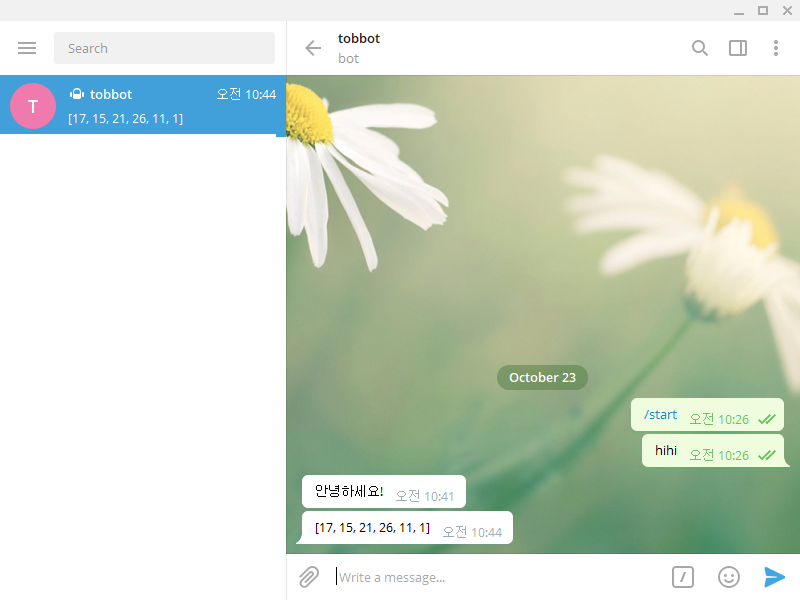

```bash
$ pip install flask
```

실행환경을 구성하기 위해서 flask 코드를 추가합니다.

```python
# app.py
from flask import Flask, request, render_templates
from decouple import config
import requests
import random

app = Flask(__name__)

token = config("TOKEN")
api_url = f"https://api.telegram.org/bot{token}"
update_url = f"{api_url}/getUpdates"
# print(update_url)

# print(api_url)

response = requests.get(update_url).json() # json형태로 받아옵니다.
# print(response['result'][0]['message']['chat'])

chat_id = response['result'][0]['message']['chat']['id']

@app.route('/write')
def write():
    return render_template('write.html')

@app.route('/send')
def send():
    message = request.args.get("message")
    message_url = f"{api_url}/sendMessage?chat_id={chat_id}&text={message}"
    requests.get(message_url)
    return "메시지 전송 완료했어용!"

if __name__ == "__main__":
    app.run(debug=True)
```

```html
<form action="/send">
    <input type="text" name="message">
    <input type="submit">
</form>
```


# 4. 웹훅 설정

텔레그램에서 사용자의 입력을 받기 위해서는 Flask가 그것을 알아차려야 합니다.

따라서 웹훅을 걸어줘야 합니다.

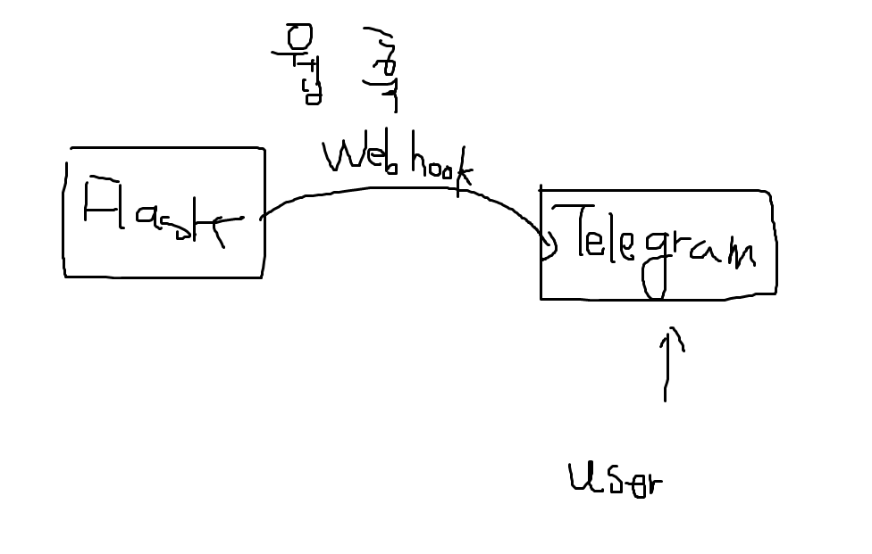

웹훅을 걸기 위해서 telegram 참조파일에 저장을 합니다.


### 4.1. ngrok 설치(사설ip -> 공인ip)

웹훅을 거는 주체의 주소가 온라인 상으로 공개되어 있지 않기 때문에, ngrok이라는 프로그램을 사용하여 진행합니다.

프로그램을 다운받아서 

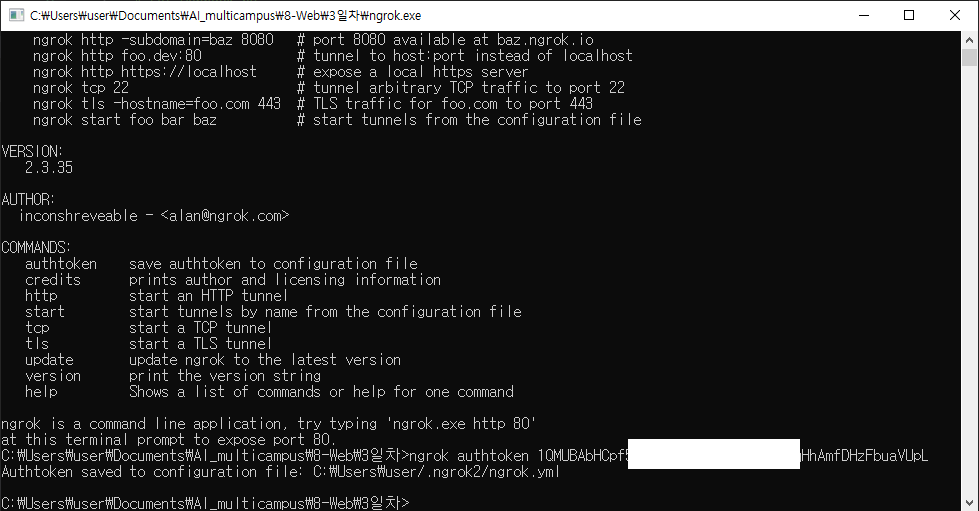

ngrok http 5000

위의 명령어를 실행하면 아래처럼 프로그램이 실행됩니다.


### 4.2. 웹훅을 설정하는 python script 작성(한 번만 실행하면 됩니다.)

```python
# set_webhook.py
# 웹훅은 한 번만 걸어주면 되기 때문에, 별도의 파일로 분리해서 관리할게요
from decouple import config
import requests

token = config("TOKEN")
api_url = f"https://api.telegram.org/bot{token}"
set_webhook_url = f"{api_url}/setWebhook?url=https://86095a49.ngrok.io/{token}"

response = requests.get(set_webhook_url)
print(response.text)
```

```bash
$ python set_webhook.py
```


## 5. 언어 모델 추가

### 5.1. google 번역 기능

구글 api 주소로 접속 : [구글 api 주소](https://console.cloud.google.com/apis)

Cloud Translation API을 상단의 주소창에서 검색해서 들어갑니다.

```python
# google_translate.py
import requests
from decouple import config

def translate(q):
    google_key = config("GOOGLE_API_KEY")

    api_url = "https://translation.googleapis.com/language/translate/v2"

    data = {
        'q': q,
        'source': 'ko',
        'target': 'en'
    }

    response = requests.post(f'{api_url}?key={google_key}', data)
    return response.json()['data']['translations'][0]['translatedText']
```


.env 파일에는 GOOGLE_API_KEY를 생성해줍니다.

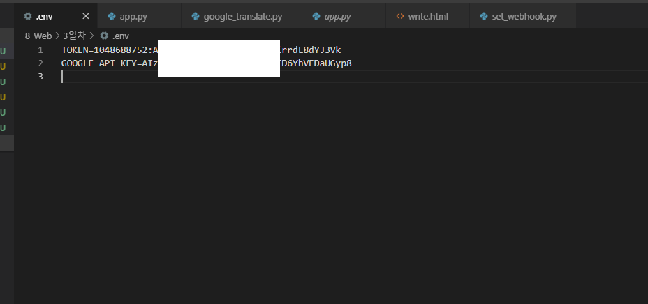

### 5.2. dialogflow로 언어 모델 자동 생성하기

dialogflow를 사용하면 언어 모델을 만들지 않아도 자동으로 언어 모델을 만들 수 있습니다.

결제정보를 입력한 후, 아래의 화면과 같이 `intent`를 새로 생성해 줍니다. intent의 이름은 food로 설정했습니다.


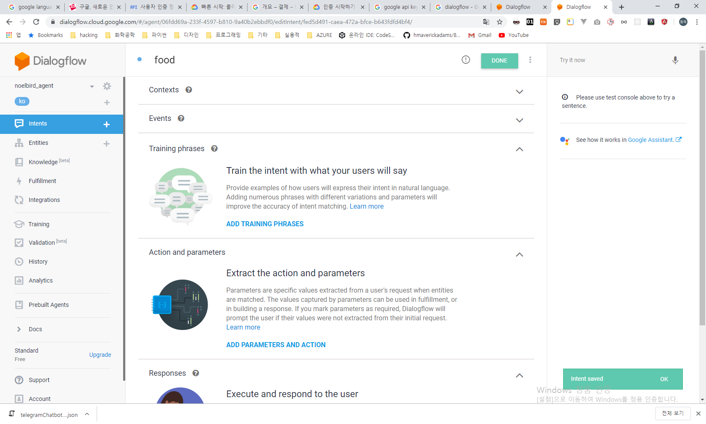


create intent를 food라는 이름으로 intent를 만들어줍니다.

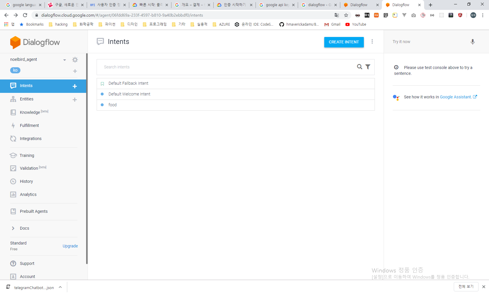


training phrases에 비슷한 발화들을 적어줍니다.

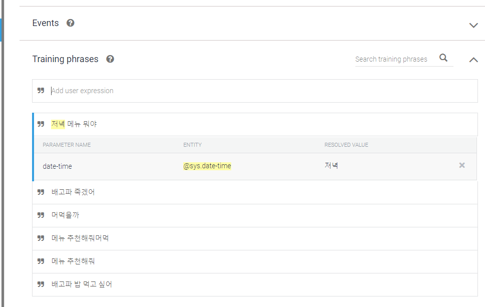

Responses에도 `메뉴 추천해 드릴까요?`라고 적습니다.

agent에 배고파라고 테그트하면 결과가 나옵니다.

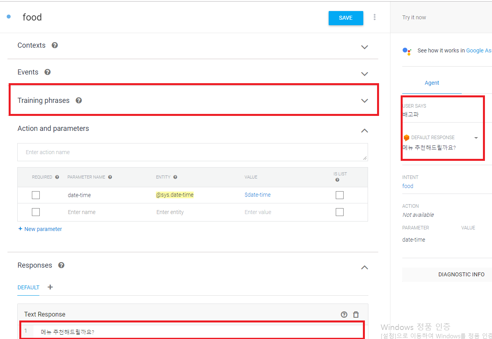


다시 푸드로 와서 Add follow up intent를 클릭하면 다음과 같이 화면이 떠서 custom을 눌러줍니다.

다음에 이어질 대화를 구성할 수 있습니다.


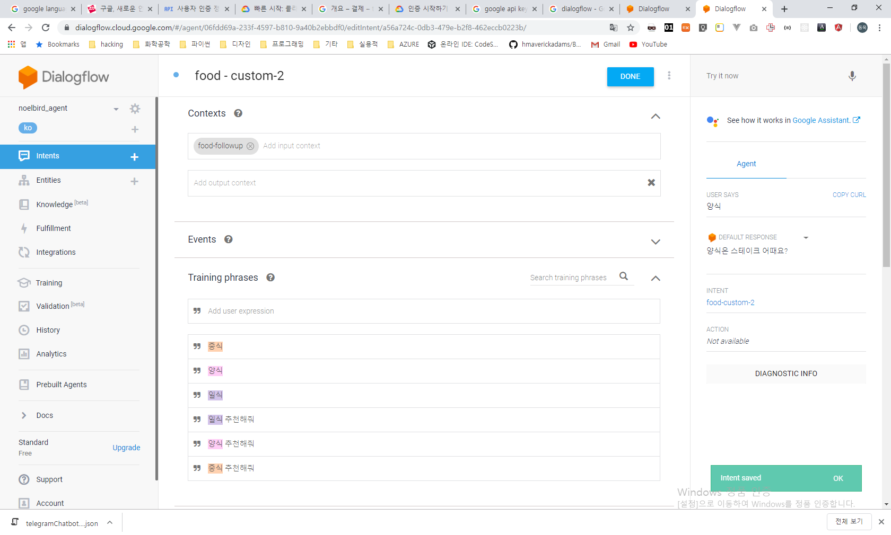

Training phrases에 양식 추천해줘, 중식 추천해줘, 등의 말을 적어주고,

response에도 `중식은 역시 탕짜면이죠` 등을 적어줍니다.

이제 연속해서 대화를 구성할 수 있습니다.


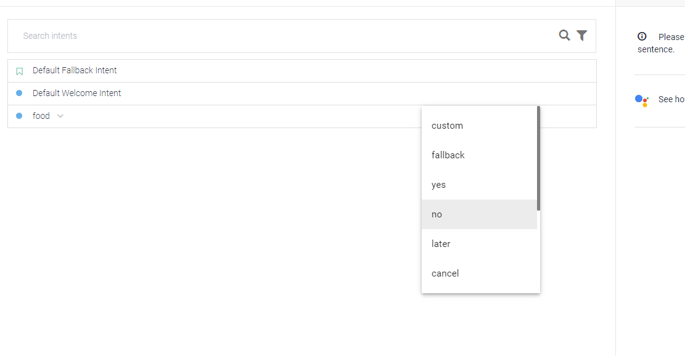

이번에는 메뉴 추천을 받지 않고 싶은 경우를 위해서 거절하는 경우를 위해 intent를 만들어 줍니다.

text response에는 `죄송해요. 메뉴 고르기가 세상에서 제일 어렵네요`

를 적어주고 save를 합니다.


integrety에는 telegram > token을 설정하는데,

아까 .env파일에서 환경변수로 설정해준 것으로 설정할 수 있습니다.


이렇게 하면, 기존의 내용들이 실행이 안되고 


dialogflow에서 설정한 내용만 나오게 됩니다.

이제 dialogflow에서 fullfillment > webhook에다가

아까 설정했던 웹훅 주소인 ngrok 주소를 적어줍니다.


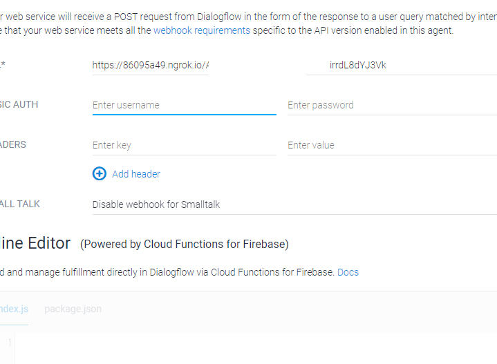


## 6. 원래 기능 복원

dialogflow에서 웹훅을 설정하면, ngrok으로부터 나온 웹훅이 풀리기 때문에 번역 기능, 로또 기능 등이 동작하지 않습니다.

따라서 dialogflow에서 로컬과 연결되어 있는 ngrok으로 데이터를 보내주도록 설정해줍니다.


```python
# app.py - 전체 소스코드
from flask import Flask, request, render_template, jsonify
from decouple import config
import requests
import random

import google_translate as gt # 사용자 라이브러

app = Flask(__name__)

token = config("TOKEN")
token_short = ''.join(token.split(':')[1:])
api_url = f"https://api.telegram.org/bot{token}"
update_url = f"{api_url}/getUpdates"
# print(update_url)

# print(api_url)

response = requests.get(update_url).json() # json형태로 받아옵니다.
# print(response['result'][0]['message']['chat'])

@app.route('/write')
def write():
    return render_template('write.html')

@app.route('/send')
def send():
    message = request.args.get("message")
    message_url = f"{api_url}/sendMessage?chat_id={chat_id}&text={message}"
    requests.get(message_url)
    return "메시지 전송 완료했어용!"

# 로컬에서 ngrok을 통해서 동작하도록 만든 함수
@app.route(f'/{token}', methods=["POST"])
def telegram():
    message = request.get_json()

    # chat id를 가져옵니다.
    chat_id = message['message']['chat']['id']

    # 우리가 텔레그램에서 보낸 메세지를 꺼냅니다.
    text = message['message']['text']

    if text == "로또":
        reply = random.sample(range(1, 46), 6)
    elif text[0:3] == '/번역':
        reply = gt.translate(text[4:])
    else:
        reply = text

    # 메세지를 보내는 요청 주소를 통해 텔레그램에 전달!
    message_url = f"{api_url}/sendMessage?chat_id={chat_id}&text={reply}"
    requests.get(message_url)

    return f'{chat_id} / {text}', 200

# dialogflow를 통해서 동작하도록 만든 함수
@app.route(f'/{token_short}', methods=["POST"])
def telegram2():
    message = request.get_json()

    # 우리가 텔레그램에서 보낸 메세지를 꺼냅니다.
    text = message['queryResult']['queryText']

    if text == "로또":
        reply = ' '.join(map(str, random.sample(range(1, 46), 6)))
    elif text[0:3] == '/번역':
        reply = gt.translate(text[4:])
    else:
        reply = text

    # 메세지를 보내는 요청 주소를 통해 텔레그램에 전달!
    # message_url = f"{api_url}/sendMessage?chat_id={chat_id}&text={reply}"
    # requests.get(message_url)
    result = {'fulfillmentText': reply}
    return jsonify(result)
    # return f'{chat_id} / {text}', 200


if __name__ == "__main__":
    app.run(debug=True)
```


## 7. 배포 - pythonanywhere


web -> add a new web -> flask -> python 3.7

path는 아래와 같이 그대로 사용합니다.

```bash
/home/noelbird/mysite/flask_app.py
```

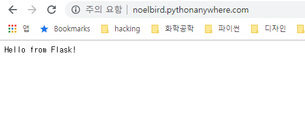

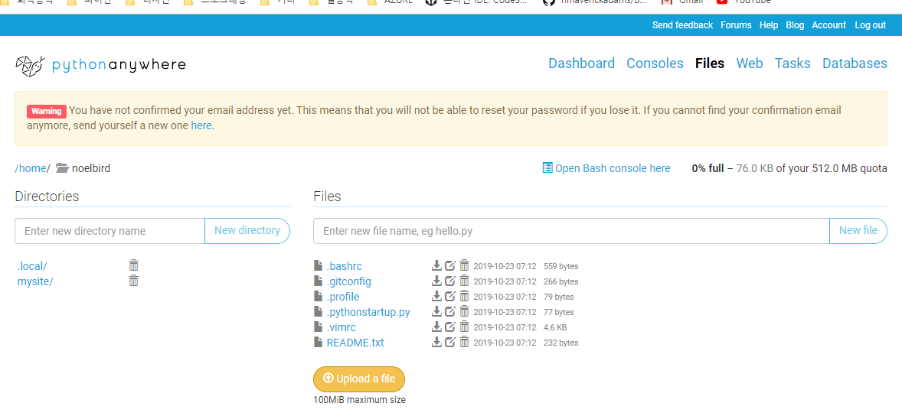

오른쪽 상단의 Files를 누르면 위와 같은 화면이 뜹니다.

왼쪽에서 mysite/를 클릭하면 flask 폴더로 들어갑니다.

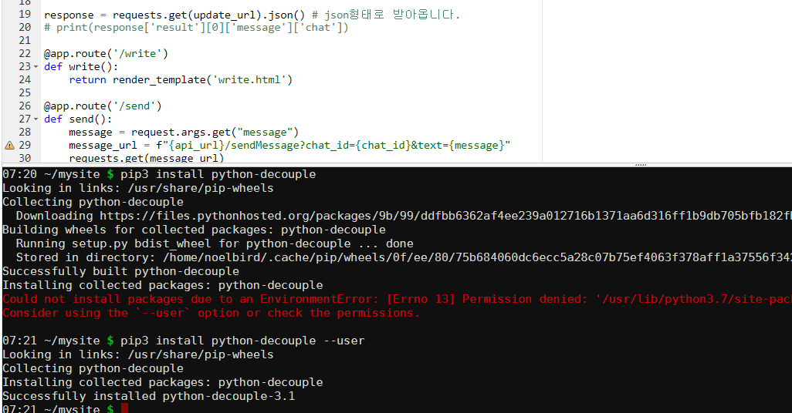

```bash
pip3 install python-decouple --user
```

위의 명령어를 이용해서 python-decouple을 설치 해줍니다.

```text
app.py
.env
google_translate.py
```

위의 세 파일을 mysite에 업로드 한 다음

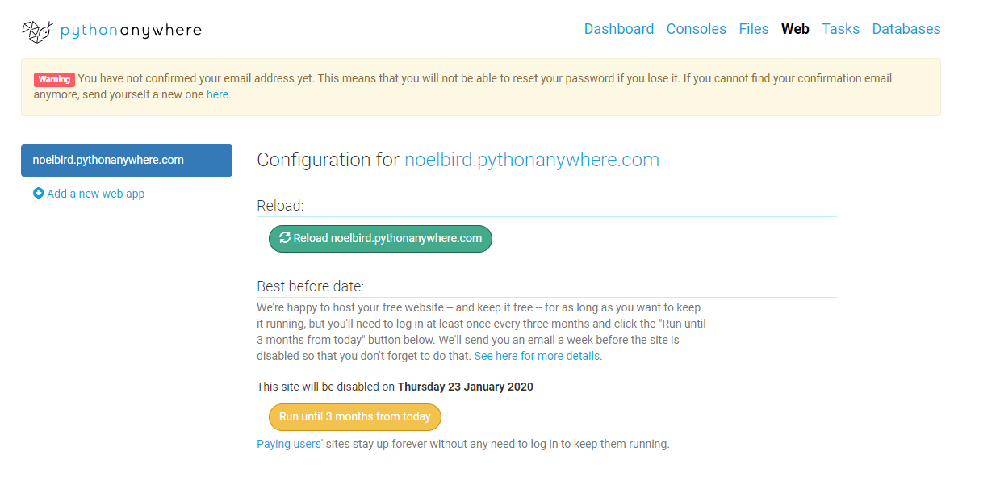

위와 같이 Reload 버튼을 눌러 줍니다. 그렇다면, 다른 명령을 주지 않아도 알아서 flask app을 실행합니다.


다시 dialogflow의 fulfillment에서 webhook의 주소를 재설정 해줍니다.

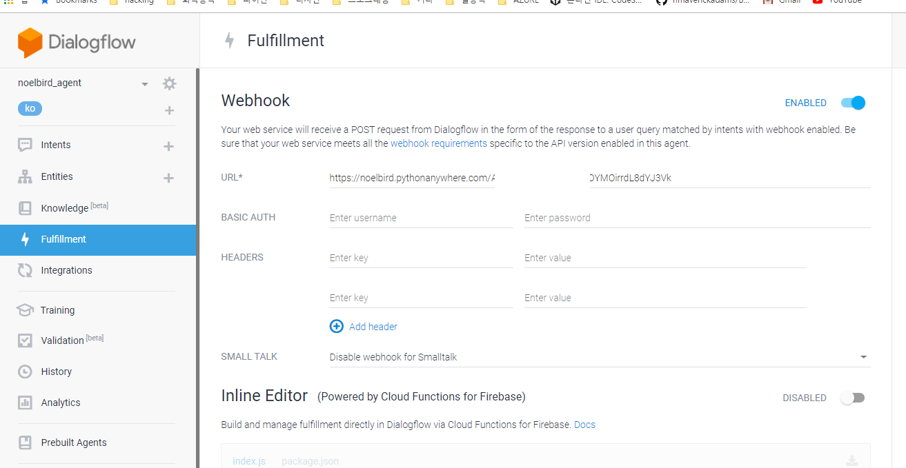


## 8. 결과

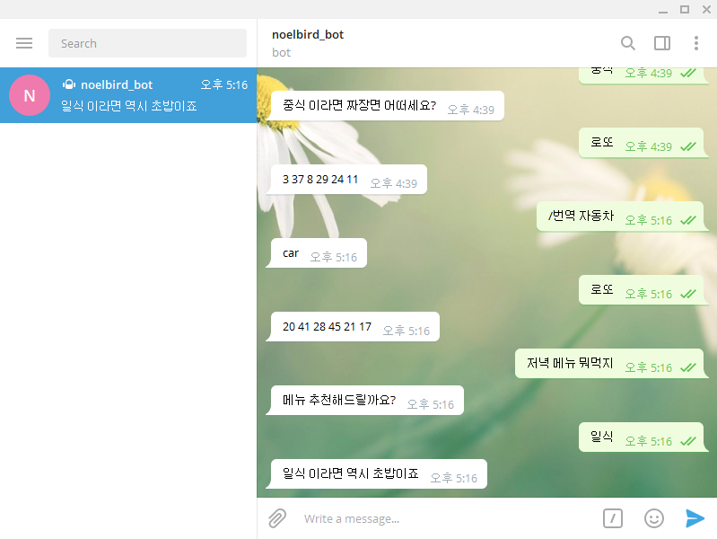

번역, 로또, dialogflow 기능 셋 전부 정상 작동합니다.(2019-10-23 기준 3개월간 동작)